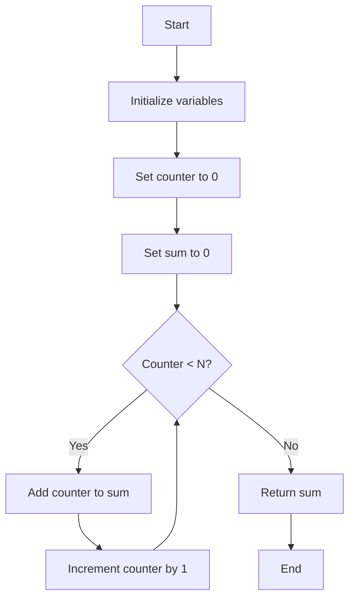
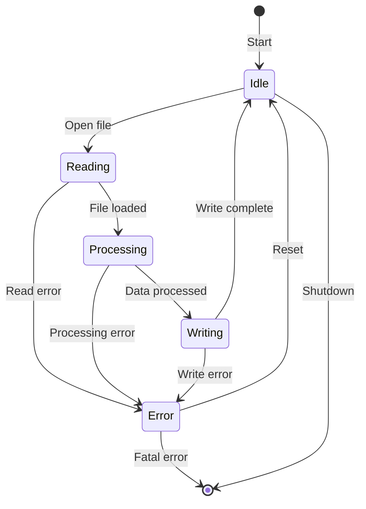
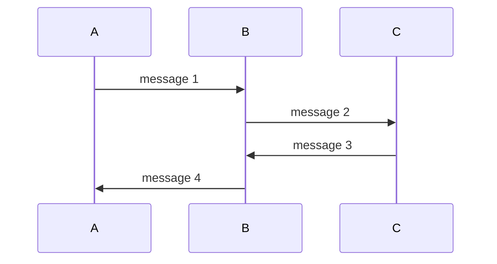
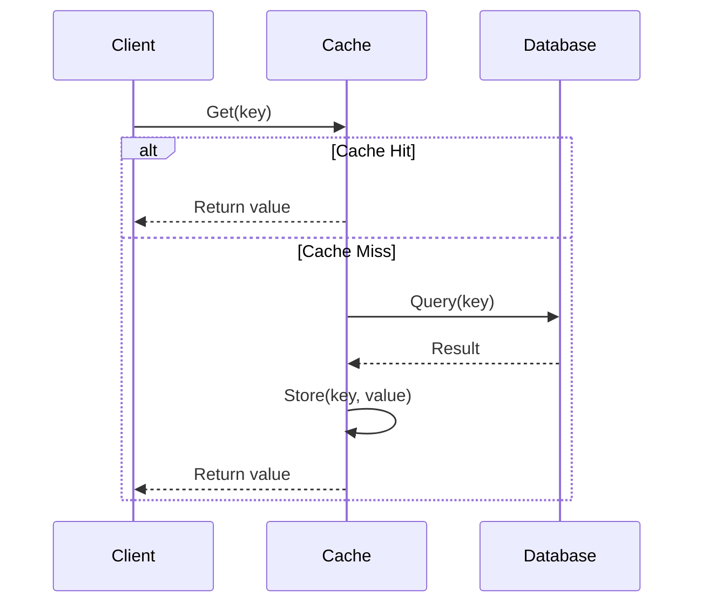

# Visual Aid Patterns

Reference for creating effective diagrams, visualizations, and mathematical illustrations.

---

## When to Use Each Format

### Decision Tree

```
Need to visualize?
  ├─ Process/workflow with decisions → Mermaid flowchart
  ├─ State transitions → Mermaid state diagram
  ├─ Sequential interactions → Mermaid sequence diagram
  ├─ Tree structure → ASCII box-drawings
  ├─ Array/memory layout → ASCII box-drawings
  ├─ Mathematical diagram → LaTeX (or ASCII approximation)
  └─ Graph/network → Mermaid graph or ASCII
```

---

## Mermaid Diagrams

### Flowchart for Algorithms

❌ **BAD: Too much detail, cluttered**

**Why it's bad:** Excessive granularity obscures the algorithm's logic.

✅ **GOOD: Focus on key decisions and structure**
```mermaid
flowchart TD
    Start([Input: array arr, target])
    Init[left = 0, right = n-1]
    Check{left ≤ right?}
    CalcMid[mid = ⌊left + right/2⌋]
    Found{arr[mid] = target?}
    Less{arr[mid] < target?}
    ReturnMid[Return mid]
    GoRight[left = mid + 1]
    GoLeft[right = mid - 1]
    NotFound[Return -1]
    
    Start --> Init
    Init --> Check
    Check -->|Yes| CalcMid
    Check -->|No| NotFound
    CalcMid --> Found
    Found -->|Yes| ReturnMid
    Found -->|No| Less
    Less -->|Yes| GoRight
    Less -->|No| GoLeft
    GoRight --> Check
    GoLeft --> Check
```

---

### State Diagrams for FSM

❌ **BAD: Missing transitions or unclear states**


✅ **GOOD: Clear states, labeled transitions, all cases**


Use Case: Teaching state machines in parsing, protocol handling, or UI flows

---

### Sequence Diagrams for Interactions

❌ **BAD: Too many details, unclear flow**


✅ **GOOD: Semantic labels, activation bars, return messages**


Use Case: Teaching API interactions, distributed systems, async communication

---

## ASCII Box-Drawings

### Tree Structures

❌ **BAD: Unclear parent-child relationships**
```
    8
   / \
  3   10
 / \    \
1   6   14
```

✅ **GOOD: Clear visual hierarchy with box-drawing characters**
```
Binary Search Tree:

         ┌─────────┐
         │    8    │
         └────┬────┘
              │
      ┌───────┴───────┐
      │               │
   ┌──┴──┐         ┌──┴──┐
   │  3  │         │ 10  │
   └──┬──┘         └──┬──┘
      │               │
   ┌──┴──┐            └──┐
   │     │               │
┌──┴──┐ ┌┴───┐       ┌───┴──┐
│  1  │ │ 6  │       │  14  │
└─────┘ └────┘       └──────┘

Properties:
- Left subtree < parent
- Right subtree > parent
- In-order: 1, 3, 6, 8, 10, 14
```

---

### Array and Memory Layouts

❌ **BAD: Unclear indexing or structure**
```
array: 1 2 3 4 5
```

✅ **GOOD: Explicit indices and structure**
```
Array Layout:

Index:  0   1   2   3   4
       ┌───┬───┬───┬───┬───┐
Value: │ 1 │ 2 │ 3 │ 4 │ 5 │
       └───┴───┴───┴───┴───┘
        ↑               ↑
      start           end


2D Array (Matrix):

        Col 0  Col 1  Col 2
       ┌──────┬──────┬──────┐
Row 0: │  1   │  2   │  3   │
       ├──────┼──────┼──────┤
Row 1: │  4   │  5   │  6   │
       ├──────┼──────┼──────┤
Row 2: │  7   │  8   │  9   │
       └──────┴──────┴──────┘

Access: arr[1][2] = 6


Linked List:

Head
  ↓
┌───┬──┐    ┌───┬──┐    ┌───┬──┐    ┌───┬──────┐
│ 1 │ ●┼───→│ 2 │ ●┼───→│ 3 │ ●┼───→│ 4 │ NULL │
└───┴──┘    └───┴──┘    └───┴──┘    └───┴──────┘
             
Node structure:
┌───────┬──────┐
│ data  │ next │
└───────┴──────┘
```

---

### Stack and Queue Visualizations

❌ **BAD: Direction unclear**
```
Stack: [1, 2, 3, 4]
```

✅ **GOOD: Show direction of operations**
```
Stack (LIFO):

       push(5)
          ↓
       ┌─────┐
       │  4  │ ← top (pop here)
       ├─────┤
       │  3  │
       ├─────┤
       │  2  │
       ├─────┤
       │  1  │
       └─────┘ ← bottom


Queue (FIFO):

enqueue(5)                    dequeue()
    ↓                             ↓
  ┌───┬───┬───┬───┐           ┌───┐
  │ 1 │ 2 │ 3 │ 4 │           │ 1 │
  └───┴───┴───┴───┘           └───┘
   ↑               ↑
 front            rear
```

---

## LaTeX Mathematical Diagrams

### Function Visualization

❌ **BAD: Text description without visual**
```
f(x) maps x to x²
```

✅ **GOOD: Visual representation with LaTeX**
```
Function Mapping: $f: \mathbb{R} \to \mathbb{R}$ where $f(x) = x^2$

Domain → Codomain visualization:

$$
\begin{array}{ccc}
x & \xrightarrow{f} & f(x) = x^2 \\
-2 & \mapsto & 4 \\
-1 & \mapsto & 1 \\
0 & \mapsto & 0 \\
1 & \mapsto & 1 \\
2 & \mapsto & 4 \\
\end{array}
$$

Properties:
- Not injective (one-to-one): $f(-2) = f(2) = 4$
- Not surjective (onto): No $x$ maps to $-1$
```

---

### Matrix Operations

❌ **BAD: Showing only result**
```
A × B = C
```

✅ **GOOD: Step-by-step with LaTeX alignment**
```
Matrix Multiplication: $A \times B = C$

Given:
$$
A = \begin{bmatrix} 1 & 2 \\ 3 & 4 \end{bmatrix}, \quad
B = \begin{bmatrix} 5 & 6 \\ 7 & 8 \end{bmatrix}
$$

Computation:
$$
\begin{align*}
C_{11} &= (1)(5) + (2)(7) = 5 + 14 = 19 \\
C_{12} &= (1)(6) + (2)(8) = 6 + 16 = 22 \\
C_{21} &= (3)(5) + (4)(7) = 15 + 28 = 43 \\
C_{22} &= (3)(6) + (4)(8) = 18 + 32 = 50
\end{align*}
$$

Result:
$$
C = \begin{bmatrix} 19 & 22 \\ 43 & 50 \end{bmatrix}
$$

General formula: $(AB)_{ij} = \sum_{k=1}^{n} A_{ik} B_{kj}$
```

---

### Set Operations

❌ **BAD: Just set notation**
```
A ∪ B, A ∩ B
```

✅ **GOOD: Venn diagram using ASCII + LaTeX**
```
Set Operations:

Given:
$A = \{1, 2, 3, 4, 5\}$
$B = \{4, 5, 6, 7, 8\}$

Venn Diagram (ASCII approximation):
```
        ╭─────────╮     ╭─────────╮
        │    A    │     │    B    │
        │         │     │         │
        │  1   2  │  ╭──┴──╮  7   │
        │      3  ├──┤4   5├──┐ 8 │
        │         │  ╰──┬──╯  │   │
        ╰─────────╯     │  6  │   │
                        ╰─────────╯
```

Results:
$$
\begin{align*}
A \cup B &= \{1, 2, 3, 4, 5, 6, 7, 8\} \quad \text{(union)} \\
A \cap B &= \{4, 5\} \quad \text{(intersection)} \\
A \setminus B &= \{1, 2, 3\} \quad \text{(difference)} \\
A \triangle B &= \{1, 2, 3, 6, 7, 8\} \quad \text{(symmetric difference)}
\end{align*}
$$
```

---

## Graph Visualizations

### Directed Graph

❌ **BAD: Unclear direction or structure**
```
A connects to B and C
B connects to D
```

✅ **GOOD: Clear directed edges with labels**
```
Directed Graph (Adjacency representation):

         ┌─────┐
         │  A  │
         └──┬──┘
            │
      ┌─────┴─────┐
      ↓           ↓
   ┌─────┐     ┌─────┐
   │  B  │     │  C  │
   └──┬──┘     └──┬──┘
      │           │
      ↓           ↓
   ┌─────┐     ┌─────┐
   │  D  │←────│  E  │
   └─────┘     └─────┘

Adjacency List:
A → [B, C]
B → [D]
C → [E]
D → []
E → [D]

Adjacency Matrix:
    A  B  C  D  E
A [ 0  1  1  0  0 ]
B [ 0  0  0  1  0 ]
C [ 0  0  0  0  1 ]
D [ 0  0  0  0  0 ]
E [ 0  0  0  1  0 ]
```

---

### Weighted Graph

❌ **BAD: Missing weights or unclear paths**
```
A - B - C - D
```

✅ **GOOD: Explicit weights and paths**
```
Weighted Graph (Shortest Path Problem):

        5         2
    A ──────── B ──────── C
    │          │          │
  1 │          │ 3        │ 4
    │          │          │
    D ──────── E ──────── F
        6         1

Edge Weights:
AB: 5    BC: 2    CF: 4
AD: 1    BE: 3    EF: 1
DE: 6

Shortest path A → F:
Option 1: A → B → C → F = 5 + 2 + 4 = 11
Option 2: A → D → E → F = 1 + 6 + 1 = 8  ← Shortest
Option 3: A → B → E → F = 5 + 3 + 1 = 9
```

---

## Algorithm Step-by-Step Visualization

### Sorting Animation (using ASCII)

❌ **BAD: Just showing final result**
```
Unsorted: [5, 2, 8, 1, 9]
Sorted: [1, 2, 5, 8, 9]
```

✅ **GOOD: Step-by-step progression**
```
Bubble Sort Visualization:

Initial: [5, 2, 8, 1, 9]

Pass 1:
  [5, 2, 8, 1, 9]  Compare 5,2 → Swap
  [2, 5, 8, 1, 9]  Compare 5,8 → No swap
  [2, 5, 8, 1, 9]  Compare 8,1 → Swap
  [2, 5, 1, 8, 9]  Compare 8,9 → No swap
  [2, 5, 1, 8, 9]  Largest (9) in place ✓

Pass 2:
  [2, 5, 1, 8, 9]  Compare 2,5 → No swap
  [2, 5, 1, 8, 9]  Compare 5,1 → Swap
  [2, 1, 5, 8, 9]  Compare 5,8 → No swap
  [2, 1, 5, 8, 9]  Second largest (8) in place ✓

Pass 3:
  [2, 1, 5, 8, 9]  Compare 2,1 → Swap
  [1, 2, 5, 8, 9]  Compare 2,5 → No swap
  [1, 2, 5, 8, 9]  Third largest (5) in place ✓

Pass 4:
  [1, 2, 5, 8, 9]  Compare 1,2 → No swap
  [1, 2, 5, 8, 9]  All sorted ✓

Final: [1, 2, 5, 8, 9]

Comparisons: 10
Swaps: 4
```

---

## Complexity Visualization

### Time Complexity Comparison

❌ **BAD: Just listing O(n), O(n²)**
```
Linear: O(n)
Quadratic: O(n²)
```

✅ **GOOD: Visual comparison with scale**
```
Algorithm Time Complexity (n = 1000 elements)

n = 1000:
┌──────────────────────────────────────────────────────────┐
│ O(1)       : 1 operation          ■                      │
│ O(log n)   : 10 operations        ■■                     │
│ O(n)       : 1,000 operations     ■■■■■■■               │
│ O(n log n) : 10,000 operations    ■■■■■■■■■■■■         │
│ O(n²)      : 1,000,000 operations ■■■■■■■■■■■■■■■■■■■ │
│ O(2ⁿ)      : INFEASIBLE           ■■■■■■■■■■■■■■■■■■■■■■■■■ (off scale)
└──────────────────────────────────────────────────────────┘

Formal definitions:
$$
\begin{align*}
O(1) &: \text{Constant - independent of input size} \\
O(\log n) &: \text{Logarithmic - halves problem each step} \\
O(n) &: \text{Linear - once through data} \\
O(n \log n) &: \text{Linearithmic - optimal comparison sort} \\
O(n^2) &: \text{Quadratic - nested loops} \\
O(2^n) &: \text{Exponential - combinatorial explosion}
\end{align*}
$$

Practical impact:
For n = 1,000,000:
- O(log n): ~20 operations (binary search)
- O(n): 1M operations (linear scan)
- O(n²): 1T operations (bubble sort - impractical!)
```

---

## Combining Multiple Formats

### Complete Example: Binary Search

```
Binary Search Algorithm

Concept: Find target in sorted array by repeatedly halving search space

Visual Process:
```mermaid
flowchart TD
    Start([Array: sorted, Target: value])
    Init[left = 0, right = n-1]
    Loop{left ≤ right?}
    Mid[mid = left + right / 2]
    Check{arr[mid] vs target}
    Found[Return mid]
    Left[right = mid - 1]
    Right[left = mid + 1]
    NotFound[Return -1]
    
    Start --> Init
    Init --> Loop
    Loop -->|Yes| Mid
    Loop -->|No| NotFound
    Mid --> Check
    Check -->|Equal| Found
    Check -->|Less| Right
    Check -->|Greater| Left
    Right --> Loop
    Left --> Loop
```

Step-by-step Example:
Array: [1, 3, 5, 7, 9, 11, 13, 15]  Target: 7

```
Step 1:
Indices: 0  1  2  3  4   5   6   7
Values: [1, 3, 5, 7, 9, 11, 13, 15]
         ↑           ↑            ↑
       left        mid         right
       
mid = (0 + 7) / 2 = 3
arr[3] = 7 = target → FOUND at index 3
```

Complexity Analysis:
$$
\begin{align*}
T(n) &= T(n/2) + O(1) \quad \text{(recurrence relation)} \\
     &= O(\log n) \quad \text{(Master Theorem)}
\end{align*}
$$

Each iteration halves the search space:
n → n/2 → n/4 → ... → 1
Number of halvings = $\log_2 n$
```
